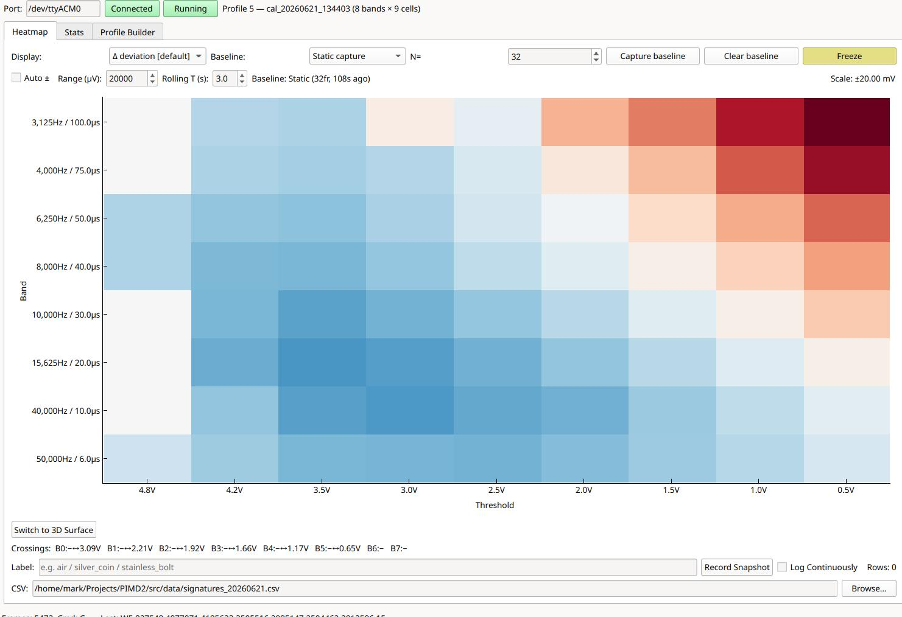
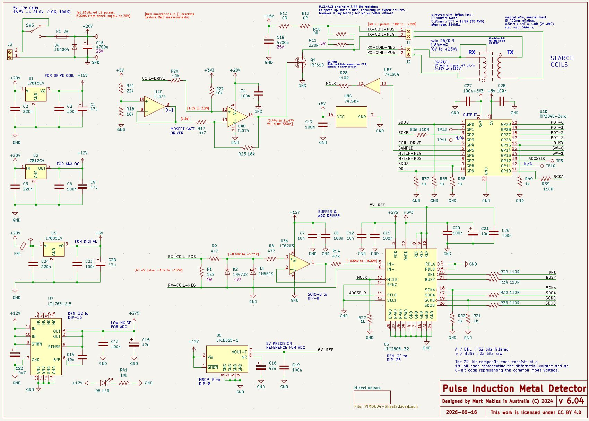

# PIMD — Pulse Induction Metal Detector

*A from-scratch, multi-band pulse-induction metal detector built for autonomous, position-tagged ground survey.*



> Above: a single live frame with a steel spanner **and** a copper pipe under the coil. The two
> materials separate *spatially* inside the decay-space matrix — non-ferrous (blue) collapses early,
> ferrous (red) persists late. Getting that separation out of a pulse-induction detector is the whole point.

**Up to date Build diary:** <https://makies.com.au/pulse-induction-metal-detector/>

---

## What it is

A pulse-induction (PI) metal detector designed and built from scratch since November 2023 by a maker
with no prior analogue-electronics background. It is **not** a clone — several design choices are
deliberately unconventional.

In the language of the field, it's a **low-cost, monostatic time-domain electromagnetic (TEM)
spectrometer doing cued interrogation** — though it started life as nothing more ambitious than
"let's build a metal detector with no experience." It is one payload of a larger system: the coil is
towed on a trailer behind **Roverling**, an autonomous RTK-GPS ground robot, so every detection event
can be tagged with centimetre-level position and streamed back over LoRa. It therefore has to be
*quiet, stable and remotely controllable*, not merely sensitive.

What makes it unusual among PI detectors is that it doesn't optimise a single operating point.
It cycles through a user-defined grid of operating points and reports, for every frame, a
two-dimensional **decay-space matrix** — frequency/pulse-width on one axis, decay-amplitude (time) on
the other — that is designed from the ground up as an input to a classifier.

## How it works (in brief)

A high-current pulse energises the TX coil; on hard cutoff the collapsing field produces a flyback
and then a decaying eddy-current response. A nearby target perturbs that decay. The conditioned RX
signal is sampled at precise, calibrated delays.

- **Mode 1** — a single filtered (32-bit) sample at one held delay: the low-noise telemetry path, used for baselines and field tests.
- **Mode 2** — an interleaved sweep across a profile of *(frequency, pulse-width, sample-delay)* points, reported as one frame per sweep. The grid is not fixed by the hardware, and it has deliberately *narrowed* as the corpus taught which cells earn their place. The July 2026 signature corpus was captured on a **63-cell** grid (7 pulse widths × 9 delays, spaced geometrically 9 → 100 µs at ×1.5 per step). The **current profile, `cal_2x11_v5`, runs 2 pulse widths (10 and 100 µs) × 11 sample delays = a 22-cell matrix**, sweeping at **16.1 Hz** *(measured)* — ~30% faster frames for the loss of the redundant middle bands. It is **not yet locked and has no corpus behind it**. Repetition rates are chosen to hold duty near 30%; the 100 µs band runs at 3.125 kHz and **requires the cooling fan** (see Hardware).
- Sample delays use **two anchoring schemes in one profile**, where a PI profile conventionally picks one. Early cells are **amplitude-anchored** to a ladder of voltages (**2.4 V → 125 mV**) high on the flyback decay rather than the usual bottom ~700 mV — that region carries the most discrimination information, and it is where target *polarity* separates the families. Late cells are **time-anchored** on a geometric ladder out along the tail, because past the front end's lobe both families read positive and only *decay rate* separates them. Every delay is snapped to the 8 ns PWM grid (off-grid requests are silently rounded by the hardware). The profile spans the decay from 2.4 V down to the ~70 mV pedestal with no gaps — the null minimum is sampled deliberately, not avoided.
- **Polarity convention:** ferrous targets read **positive** (stored magnetic energy reinforces the decay); non-ferrous read **negative** (opposing eddy currents weaken it). A third class turns out to be common in practice: **crossover targets** (cast iron, some stainless, real jewelry with steel fittings) read negative at short pulses and positive at long ones — the pulse-width axis resolves what a single operating point would misclassify.

## Highlights

- A multi-band decay-space matrix recovering **multi-time-constant discrimination from a PI platform** — something most commercial PI detectors don't attempt.
- **Validated on a 17-target labelled corpus** (July 2026): signature *shape* is invariant with target distance (5–15 cm, 30× amplitude range) and repeats across sessions and recalibrations to within a few percent — the property the classification layer is built on.
- Targets fall into **three shape families** — ferrous, non-ferrous, and crossover — and overlapping targets combine **linearly** (a spanner + copper pipe frame decomposes back into its parts at 0.99 correlation), so unmixing is on the table, not just classification.
- Phase-locked TX/sample timing on one RP2040 PWM slice — **~5 ns sample-trigger jitter (measured)**.
- LTC2508-32 dual-output front end (filtered 32-bit + raw 14-bit no-latency).
- A dedicated delay-calibration tool that measures the clip-release point per band and exports calibrated profiles.
- Three PyQt6 desktop tools: live Mode 1 GUI, the Mode 2 heatmap + ML-data bridge (`ClassViz`, including a self-describing session recorder for training data), and the delay calibrator.
- Built for autonomous use: RTK-GPS position tagging, LoRa telemetry, single dedicated low-noise supply.

## Repository layout

```
README.md                  This file — start here
DESIGN.md                  Full engineering reference (hardware, firmware, protocol, test log)
CHANGELOG.md               Project change log
CLAUDE.md                  Contributor / agent conventions (version bumps, changelog discipline)

mcu/                       MicroPython firmware for the RP2040-Zero
  pimd_mcu.py  main.py

src/                       PC-side tools (PyQt6)
  pimd_gui.py              Mode 1 filtered-telemetry GUI
  pimd_classviz.py         Mode 2 decay-space heatmap + ML logger
  pimd_delaycal.py         Delay-calibration sweep tool
  pimd_rawlog.py           Raw Mode 2 session logger
  pimd_pack.py             Shared 6S pack fuel-gauge maths (imported by the four GUI apps)
  pimd_shape.py            Shared feature maths (family / crossing / decay persistence)
  pimd_features.py         Training-corpus builder
  pimd_target_check.py     Target-registry validator
  pimd_corpus_check.py     Corpus-level acceptance checker
  requirements.txt
  data/                    Settings, captured CSVs and calibrated profiles (runtime-generated)

Electronics/PIMD604/       KiCad project — schematic rev 6.04 (as-built)

References/                Schematic export, scope captures, sample heatmaps
```

## Toolchain & workflow

The firmware is the measurement primitive; every PC tool is a client of the same USB-serial
protocol (`DESIGN.md` §9). Together they form one pipeline:

```
mcu/pimd_mcu.py (RP2040)            — the measurement primitive
      │  USB-serial, ASCII records (DESIGN §9)
      ├─► src/pimd_delaycal.py      — calibrates sample delays,
      │        exports cal_*.json profiles ──► src/data/profiles/
      ├─► src/pimd_gui.py           — Mode 1 live telemetry / bench monitor
      ├─► src/pimd_rawlog.py        — verbatim Mode 2 session logger (ground truth)
      └─► src/pimd_classviz.py      — Mode 2 heatmap; loads & runs saved profiles;
               │    captures signatures ──► src/data/corpora/ + src/data/sessions/
               └─ uses src/pimd_shape.py — shared feature maths
                            │
                            ▼
          src/pimd_features.py + src/pimd_target_check.py
               — registry-validated training-corpus builder ──► ML corpus
```

`pimd_pack.py` is shared by all four GUI apps, so they can never disagree about the same battery.

**Typical workflow**

1. Flash the firmware once (`DESIGN.md` §16).
2. Run **delaycal** after a full thermal soak to produce a calibrated profile; lock the profile JSON.
3. Run **classviz**, *Load & Run* the locked profile, and capture target signatures against the
   target registry in `src/data/targets/`.
4. Build the corpus with **features**; gate a capture day with **corpus_check**.

**gui** is the independent Mode 1 bench monitor used for noise-floor and drift investigation at a
single operating point. **rawlog** is the deliberately dumb recorder: it writes every line the
firmware sends, verbatim, so there is always a raw record no display logic can corrupt. Never run
Mode 1 and Mode 2 at once — always send `E` between mode switches.

> Each tool carries its own detailed operating notes — intent, wire commands used, record formats
> and per-version lineage — in its **file header**, which is updated in the same edit that changes
> the behaviour. Current firmware and tool versions, and the operating profile in use, are on the
> header line at the top of **`DESIGN.md`**; they are deliberately not duplicated here.

## Quick start

No build step for either the PC tools or the firmware.

### PC tools

```bash
python3 -m venv .venv && source .venv/bin/activate
pip install -r src/requirements.txt
cd src
python pimd_gui.py        # Mode 1 GUI (filtered telemetry)
python pimd_classviz.py   # Mode 2 decay-space visualiser + ML bridge
python pimd_delaycal.py   # delay-calibration sweep
```

The tools connect to the board on `/dev/ttyACMx` at 115200 baud.

### Firmware

```bash
# No build step — copy onto the board, then power-cycle it.
.venv/bin/mpremote connect /dev/ttyACM0 fs cp mcu/pimd_mcu.py :pimd_mcu.py + fs cp mcu/main.py :main.py
# (mpremote reset does not re-enumerate USB reliably — power-cycle the board.)
.venv/bin/mpremote connect /dev/ttyACM0 repl
```

### Bench-test over a serial terminal (115200)

```
V                              identify / firmware version
L                              list profiles
Q5   then  G                   Mode 2: stream the loaded operating profile (W5 records);  E to stop
*5000,40000,8400,256  then S   Mode 1: stream (* records, ~20/s);  E to stop
A32                            one 32-sample boxcar average (R record)
```

> Protocol note (firmware v4.23+): the `*` command takes **freq in Hz, pulse/delay in ns**; the `D`
> dynamic-profile command takes **µs**. See `DESIGN.md` §9 for the full contract.

## Hardware

- **Schematic:** the published KiCad project is **rev 6.04**, which represents the board **as-built**. The PCB itself was fabricated from rev **6.01**; 6.04 captures the corrections — there were a few PCB issues that needed rectifying after manufacture.
- **Front end / drive:** functional but a known rework target — a future revision will replace the TX switch and gate driver (planned: STP10NM60N + TC4420/TC4429) to retire the current FET being run past its rated SOA.
- **Thermal:** a thermistor is now fitted to the TX damping resistor. Thermal drift settles to effectively zero once the resistor reaches ~80 °C, which is the dominant warm-up transient.



## Roadmap

This release is **Phase 2 — publish the work to date.** Active and planned work:

- **Phase 3 — machine learning.** Use the decay-space matrix for filtering, classification and (the stretch goal) ground discrimination. First milestone reached (July 2026): a locked, delay-calibrated operating profile and a 17-target labelled signature corpus recorded at three distances, with distance-invariance, cross-session repeatability and mixture linearity all verified in air.
- **Faster response.** First cut made (August 2026): 63 cells → 22, for ~30% faster sweeps. Because the corpus says different targets go redundant in *different* cells, the narrowed grid has to earn its keep against a fresh corpus before it can be locked — that re-validation is the open work, along with per-cell averaging.
- **Front-end revision** (TX switch + gate driver, as above), plus a scope measurement of TX coil current vs pulse width to settle whether the longest band is past the coil-current plateau.

See **DESIGN.md §14** for the full open-problems list.

## Documentation

- **[DESIGN.md](DESIGN.md)** — the complete engineering reference: measured operating envelope, coils, drive and receive chains, timing, serial protocol, power, invariants and curated test log. Self-contained; a new reader (human or agent) can pick up the project cold from it.
- **Per-app notes** — each tool's intent, operation, wire commands and version lineage live in its own **file header** (`mcu/pimd_mcu.py`, `src/pimd_*.py`); the pipeline that connects them is under *Toolchain & workflow* above.
- **Build diary** — the full chronological story, with photos and dead-ends: <https://makies.com.au/pulse-induction-metal-detector/>
- **Video** — <https://www.youtube.com/@markmakies>

## Licence

This project uses two licences, matched to the kind of work:

- **Code** (`src/`, `mcu/`) — **GNU GPL v3.0-or-later**. See [`LICENSE`](LICENSE).
- **Hardware and documentation** (`Electronics/`, `DESIGN.md`, schematics, images) — **Creative Commons Attribution-ShareAlike 4.0 (CC BY-SA 4.0)**. See [`LICENSE-docs`](LICENSE-docs).

Pulse Induction Metal Detector © 2022–2026 Mark Makies.

## Author

Built by **Mark Makies** (Australia).
Find more work at <https://makies.au/>.
